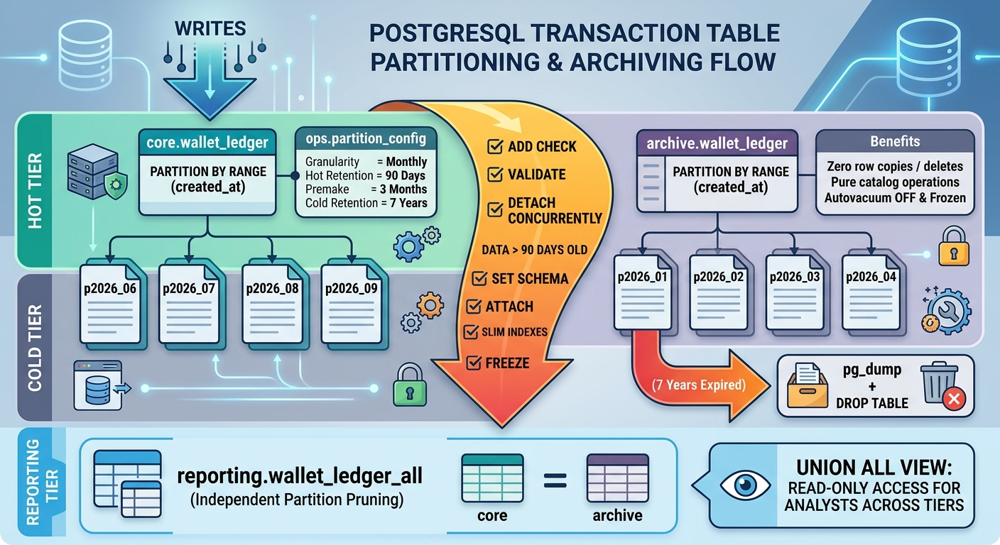

# Partitioning and archiving a transaction table in PostgreSQL

A runnable showcase: take a money ledger, range-partition it by time, keep
**90 days hot**, archive everything older, and still be able to query the
archived data with plain SQL.

Sample table: `core.wallet_ledger` — a wallet ledger (deposits, withdrawals,
bets, wins) for a gambling/fintech platform. Every script is idempotent and
safe to re-run.

> **Versions.** Tested end to end on PostgreSQL 16. Everything used requires
> **PostgreSQL 14 or newer** (`DETACH PARTITION ... CONCURRENTLY` landed in
> 14); the compose file pins 18.

**Contents**

- [The design in one picture](#the-design-in-one-picture)
- [Running it](#running-it)
- [The numbers this produces](#the-numbers-this-produces)
- [Six things to take away](#six-things-to-take-away)
- [How to read archived data](#how-to-read-archived-data)
- [Gotchas collected along the way](#gotchas-collected-along-the-way)
- [What this deliberately does not do](#what-this-deliberately-does-not-do)

---

## The design in one picture



<details>
<summary>Same diagram as text</summary>

```text
                 writes
                   │
                   ▼
      ┌────────────────────────────┐         ops.partition_config
      │   core.wallet_ledger       │         ├─ granularity   = month
      │   PARTITION BY RANGE       │         ├─ hot_retention = 90 days
      │   (created_at)             │         ├─ premake       = 3
      └────────────┬───────────────┘         └─ cold_retention= 7 years
       p2026_06  p2026_07  p2026_08  p2026_09  … + 3 empty future months
                   │
                   │  partition's whole range is older than 90 days
                   │  ──► ADD CHECK · VALIDATE · DETACH CONCURRENTLY
                   │      SET SCHEMA · ATTACH · slim indexes · FREEZE
                   ▼
      ┌────────────────────────────┐
      │  archive.wallet_ledger     │   same shape, fewer indexes,
      │  PARTITION BY RANGE        │   autovacuum off, frozen
      └────────────┬───────────────┘
       p2026_01  p2026_02  p2026_03  …         ──► pg_dump + DROP after 7 years
                   │
                   ▼
      reporting.wallet_ledger_all   =  core  UNION ALL  archive
      (one view, both tiers, pruning works on each branch independently)
```

</details>

No rows are ever copied and no rows are ever deleted to move data between
tiers. Archiving a partition is a catalog operation.

---

## Running it

```bash
docker compose up -d
```

The repo is mounted at `/work` inside the container with the same layout as on
the host, so relative paths mean the same thing on both sides. Run everything
from the repo root.

### No local psql? Use the shims (recommended)

`bin/` contains three one-line wrappers — `psql`, `pg_dump`, `pg_restore` —
that forward straight into the container. Put them on your `PATH` and every
command in this README, and both shell scripts, work unchanged:

```bash
export PATH="$PWD/bin:$PATH"

./scripts/run_all.sh                      # everything, in order
psql -f sql/01_schemas_and_table.sql      # or one script at a time
psql                                      # interactive shell
```

No `PGPASSWORD` needed — the shims connect over the container's local socket,
which the postgres image trusts.

### Or call docker directly

```bash
docker compose exec postgres psql -U postgres -d ledgerdb -f sql/01_schemas_and_table.sql
docker compose exec postgres psql -U postgres -d ledgerdb        # interactive
```

Add `-T` whenever you pipe anything in or out:

```bash
docker compose exec -T postgres psql -U postgres -d ledgerdb -c '\dt+ core.*' | less
```

### If you do have a local psql

```bash
export PGHOST=localhost PGUSER=postgres PGPASSWORD=postgres PGDATABASE=ledgerdb
./scripts/run_all.sh
```

```shell
# shortcut to run commands inside Docker
docker compose exec postgres psql -U postgres -d ledgerdb -f sql/00_reset.sql
docker compose exec postgres psql -U postgres -d ledgerdb -f sql/01_schemas_and_table.sql
docker compose exec postgres psql -U postgres -d ledgerdb -f sql/02_partition_toolkit.sql
docker compose exec postgres psql -U postgres -d ledgerdb -f sql/03_seed_data.sql
# Bigger seed
# docker compose exec postgres psql -U postgres -d ledgerdb -v players=50000 -v entries=5000000 -f sql/03_seed_data.sql
docker compose exec postgres psql -U postgres -d ledgerdb -f sql/04_hot_queries_and_pruning.sql
docker compose exec postgres psql -U postgres -d ledgerdb -f sql/05_archive_toolkit.sql
docker compose exec postgres psql -U postgres -d ledgerdb -f sql/06_run_archive.sql
docker compose exec postgres psql -U postgres -d ledgerdb -f sql/07_query_archived_data.sql
docker compose exec postgres psql -U postgres -d ledgerdb -f sql/08_cold_retention_and_restore.sql
docker compose exec postgres psql -U postgres -d ledgerdb -f sql/09_operations_and_monitoring.sql
docker compose exec postgres psql -U postgres -d ledgerdb -f sql/10_migrate_existing_table.sql
docker compose exec postgres psql -U postgres -d ledgerdb -f sql/99_teardown.sql
```
### Bigger dataset

```bash
psql -v players=50000 -v entries=5000000 -f sql/03_seed_data.sql
```

### What each script covers

| Script                              | What it covers                                                                |
|-------------------------------------|-------------------------------------------------------------------------------|
| `00_reset.sql`                      | Drop everything and start over                                                |
| `01_schemas_and_table.sql`          | The partitioned table; key choice, constraint rules, why no default partition |
| `02_partition_toolkit.sql`          | Config-driven partition creation and inspection (`ops` schema)                |
| `03_seed_data.sql`                  | 8 months of traffic + the "missing partition" failure, on purpose             |
| `04_hot_queries_and_pruning.sql`    | Plan-time vs runtime pruning, and the anti-patterns                           |
| `05_archive_toolkit.sql`            | The archive table and the DDL generator                                       |
| `06_run_archive.sql`                | DELETE vs DROP measured, then the archive run                                 |
| `07_query_archived_data.sql`        | **How to read archived data** — three access paths                            |
| `08_cold_retention_and_restore.sql` | Restoring a partition; dropping expired cold data                             |
| `09_operations_and_monitoring.sql`  | Dashboards, alerts, online index builds, automation                           |
| `10_migrate_existing_table.sql`     | Converting an existing non-partitioned table, two ways                        |
| `99_teardown.sql`                   | Clean up                                                                      |
| `scripts/archive.sh`                | The cron-able driver (dry-run supported)                                      |

### The archive driver

```bash
DRY_RUN=1 ./scripts/archive.sh        # show the plan, change nothing
./scripts/archive.sh                  # archive
PURGE=1 ./scripts/archive.sh          # also dump + drop expired cold partitions
```

---

## The numbers this produces

400,000 ledger rows over 8 months, monthly partitions, 90-day hot window.

**Removing a month of data**

| Approach                                            | Time  | Space reclaimed        | Dead tuples left |
|-----------------------------------------------------|-------|------------------------|------------------|
| `DELETE FROM ... WHERE created_at < ...` (41k rows) | 12 ms | **0 bytes**            | 25,633           |
| `DROP TABLE` the partition                          | 2 ms  | all of it, immediately | 0                |

The DELETE row count is small here. Scale it to a real ledger and the gap is
an afternoon of autovacuum versus a metadata update.

**Hot vs cold partition, comparable months**

| Partition                               | Heap   | Indexes    |
|-----------------------------------------|--------|------------|
| `core.wallet_ledger_p2026_08` (hot)     | 7.5 MB | **15 MB**  |
| `archive.wallet_ledger_p2026_05` (cold) | 3.3 MB | **1.4 MB** |

Cold partitions drop the primary key, the idempotency-key index and the
operational index, keep `(player_id, created_at)`, and add a BRIN index on
`created_at` — 24 kB where the btree it replaced was 1.2 MB.

---

## Six things to take away

**1. The partition key has to be in the WHERE clause, or nothing works.**
Pruning is the entire benefit. A lookup by `entry_id` alone touches every
partition. Make `(id, created_at)` the lookup contract in your API, not just
in the schema.

**2. Every unique constraint must contain the partition key.**
⚠️⚠️⚠️**There is no global index in Postgres**⚠️⚠️⚠️. `PRIMARY KEY (entry_id)` is rejected;
you get `PRIMARY KEY (entry_id, created_at)`. Idempotency keys are the usual
casualty — if you need a truly global one, keep it in a small unpartitioned
side table.

**3. Do not create a default partition.**
It silently swallows misrouted rows, it makes creating the correct partition
a full-scan-under-ACCESS-EXCLUSIVE operation, and it **entirely blocks
`DETACH CONCURRENTLY`** — the one command this whole archiving strategy
depends on. Pre-create partitions and alert on the runway instead. A failed
insert at 3am is better than 400 million rows in `_default`.

**4. `DETACH ... CONCURRENTLY` cannot run inside a transaction**, and that
includes inside a function or procedure. That is why the toolkit *generates*
the DDL and `\gexec` (or `archive.sh`) executes it. It also means pg_cron
cannot run the archive job as written.

**5. An explicit bounds `CHECK` is what makes `ATTACH` free.**
The implicit partition constraint disappears the moment a partition is
detached. Add `CHECK (created_at >= lo AND created_at < hi) NOT VALID`, then
`VALIDATE` it (SHARE UPDATE EXCLUSIVE — writes keep flowing), and the later
`ATTACH` skips its full scan. This is the same trick that makes the migration
in `10_migrate_existing_table.sql` a sub-second cutover.

**6. Granularity is a trade-off with two sharp edges.**
Monthly partitions + a 90-day window means 90–120 days actually stay hot,
because a partition only leaves when its *entire* range is past the cutoff.
Go weekly if that matters. But every partition costs planning time on every
query and a lock slot on every statement — a few hundred is comfortable,
several thousand is not.

---

## How to read archived data

Three paths, in order of how often you should reach for them.

**1. Query the archive directly.** It is a partitioned table like any other,
so pruning works normally:

```sql
SELECT date_trunc('month', created_at)::date, event_type, count(*), sum(amount)
  FROM archive.wallet_ledger
 WHERE created_at >= '2026-02-01' AND created_at < '2026-04-01'
 GROUP BY 1, 2;
```

**2. The unified view**, for queries that legitimately span the boundary:

```sql
SELECT tier, entry_id, created_at, amount
  FROM reporting.wallet_ledger_all
 WHERE player_id = 42
   AND created_at >= '2026-01-01' AND created_at < '2026-04-01';
```

It is a plain `UNION ALL`. The planner prunes each branch independently and
drops whichever one cannot contribute — a hot-only range produces a plan with
exactly one partition in it, the archive branch gone entirely. The view is
read-only by design: writes go to `core.wallet_ledger`.

**3. Restore the partition** when cold data needs the full hot toolkit again
(`ops.restore_plan`, in `08_cold_retention_and_restore.sql`). Expect `ATTACH`
to rebuild the indexes you dropped on the way out.

And the operational bonus: `GRANT SELECT ON ALL TABLES IN SCHEMA archive` to
analysts and nothing else — seven years of history, zero access to the ledger.
Because archived partitions never change, `pg_dump --exclude-schema=archive`
keeps your routine dumps small, and each partition can be dumped once,
verified, and shipped to object storage.

---

## Gotchas collected along the way

- **Partition bounds on `timestamptz` are resolved with the session
  `TimeZone` at DDL time.** Create partitions from a laptop in
  Europe/Belgrade and your "monthly" boundaries land at 22:00 or 23:00 UTC.
  Pin `SET timezone = 'UTC'` in every partition script (and in compose).
- **PostgreSQL 18 changed the Docker volume mount** to
  `/var/lib/postgresql`, not `/var/lib/postgresql/data`. An old compose file
  gives a crash loop.
- **A killed `DETACH CONCURRENTLY` leaves a half-detached partition.**
  `pg_inherits.inhdetachpending` is the tell; the fix is one command,
  `ALTER TABLE ... DETACH PARTITION ... FINALIZE`. Monitor for it — the
  query is in `09_operations_and_monitoring.sql` and should always return
  zero rows.
- **Index names are unique per schema, not per table.** Renaming a table
  during a migration without renaming its indexes gives you
  `relation "txn_a_pkey" already exists` halfway through the cutover
  transaction.
- **`CREATE INDEX CONCURRENTLY` is not supported on a partitioned table.**
  Use the three-step pattern: invalid index `ON ONLY` the parent, then
  `CREATE INDEX CONCURRENTLY` per partition, then
  `ALTER INDEX ... ATTACH PARTITION`. Runnable in
  `09_operations_and_monitoring.sql`.
- **`random()` is VOLATILE.** Referencing the same "random" alias several
  times in one `CASE` re-rolls the dice on every reference. It silently
  wrecked the seed data here until the categorical columns were made
  arithmetic. Same class of bug as a `now()`-based index predicate.
- **`max_locks_per_transaction`** — every partition touched needs a lock
  slot. Raise it before you go past a few hundred partitions, or a query
  that fails to prune will fail with "out of shared memory".
- **Set `lock_timeout` on every maintenance statement.** DDL that queues
  behind a long transaction parks an ACCESS EXCLUSIVE lock at the head of the
  queue, and every reader and writer piles up behind it. Failing fast and
  retrying is strictly better.

---

## What this deliberately does not do

- **pg_partman.** It does everything in `02_partition_toolkit.sql` and
  `05_archive_toolkit.sql` and is maintained by other people. Use it in
  production. The value of these scripts is seeing what it does for you.
- **Archiving to S3/Parquet or a separate cluster.** Both are reasonable next
  steps (`postgres_fdw` to a cheap archive instance, or `pg_dump` per
  partition to object storage). Keeping cold data in the same cluster means
  analysts need no second query engine, which is usually worth more than the
  storage saving until the archive gets genuinely large.
- **Sub-partitioning** (e.g. by currency inside each month). Only worth it
  when a second dimension appears in nearly every query. It multiplies the
  partition count, and the partition count is what you pay for.